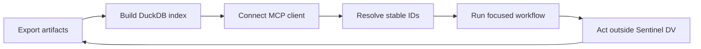

# How to Use Sentinel DV

Sentinel DV is an indexed, read-only verification intelligence layer. The normal operating loop is:



## 1. Export supported evidence

Place exported artifacts under configured roots:

- UVM logs and topology reports
- cocotb or generic JUnit XML results
- `*.assert.json` assertion definitions and failures
- SVA status JSON
- coverage JSON, XML, text, or supported HTML summaries
- `*.wave.json` summaries or VCD files
- optional live simulation status JSON

Sentinel DV does not open native FSDB or WLF databases and does not call commercial simulator APIs. Export bounded, reviewable artifacts first.

## 2. Index on a clear cadence

```bash
sentinel-dv-index --config /absolute/path/to/config.yaml --index-all
```

Use a per-project or per-workspace index. Rebuild after a regression export completes. Do not point unrelated teams at one unrestricted artifact root.

## 3. Start with discovery tools

Resolve stable identifiers before asking for details:

| Need | Start with |
| --- | --- |
| A run | `runs.list` |
| A test | `tests.list` |
| An assertion | `assertions.list` |
| Coverage records | `coverage.list` |

Use `page` and `page_size` deliberately. If the response reports additional pages, read them or state the exact subset used.

## 4. Choose the workflow

### Regression triage

Use for a failing run, pass-rate drop, baseline comparison, failure-cluster priority, or sign-off evidence review.

```text
runs.list → runs.summary → regression.health → tests.cluster
          → runs.diff → failures.list → tests.history / runs.cross_sim
```

[Complete regression triage workflow](skills/regression-triage.md)

### Failure debugging

Use for one compile, elaboration, assertion, protocol, scoreboard, timeout, x-propagation, or infrastructure-suspected failure.

```text
tests.list → tests.get → failures.list → assertions.failures
           → tests.topology → tests.history → wave.summary / wave.signals
```

[Complete failure debugging workflow](skills/failure-debugging.md)

### Coverage closure

Use for coverage status, trend, gap priority, vacuity, target stimulus, exclusions, or closure acceptance criteria.

```text
coverage.list → coverage.summary → coverage.trend → coverage.gaps
              → assertions.vacuity → coverage.advisor
```

[Complete coverage closure workflow](skills/coverage-closure.md)

## 5. Interpret evidence correctly

### Health is scoped

`regression.health` returns component scores, original weights, effective weights, raw data, and data-quality warnings. Missing coverage, assertion status, repeated test history, or cross-simulator cohorts are unavailable and excluded from the score.

### Clusters are hypotheses

`tests.cluster` groups normalized signatures. A cluster can identify investigation leverage, but it does not prove that every member has the same root cause.

### History is bounded

`tests.history` uses logical test name, suite, framework, `window_days`, optional `as_of`, and `limit`. Mixed pass/fail outcomes are a flakiness signal, not proof of nondeterminism.

### Waveforms require a hypothesis

Call `wave.summary` first. Use `wave.signals` only with a bounded interval and relevant signal question. Summary data cannot replace full waveform inspection when cycle-accurate causality is required.

### Generated code and commands are candidates

- `coverage.advisor` produces a reviewable SystemVerilog constraint candidate and sequence hint.
- `runs.submit` and `tests.replay` produce dry-run commands.

Sentinel DV never executes these outputs.

## 6. Keep reports traceable

A useful agent report preserves:

- `run_id`, `test_id`, `assertion_id`, and `signature_id`;
- suite, framework, simulator, seed, and time scope;
- evidence path or bounded extract;
- pagination and truncation limits;
- observations, inference, alternatives, and missing evidence;
- the next action and measurable acceptance criteria.

## 7. Validate your setup

For a repository checkout:

```bash
.venv/bin/python scripts/verify_all_mcp_tools.py
.venv/bin/python scripts/verify_skill_workflows.py
```

For an installed server, connect through your client and call:

```text
runs.list(page=1, page_size=10)
```

Then inspect one returned run with `runs.summary`.

## Operational checklist

- Index completed without unexpected warnings.
- The client reports `sentinel-dv` connected.
- `runs.list` returns the expected project scope.
- Security and redaction settings match the environment.
- Skills are visible in the selected agent host.
- Reports disclose missing components and truncated pages.
- Generated commands or constraints receive engineer review before use.

See [Agent setup](getting-started/agent-setup.md), [all tool contracts](tools/mcp-tools-reference.md), and [production deployment](deployment/production.md).
