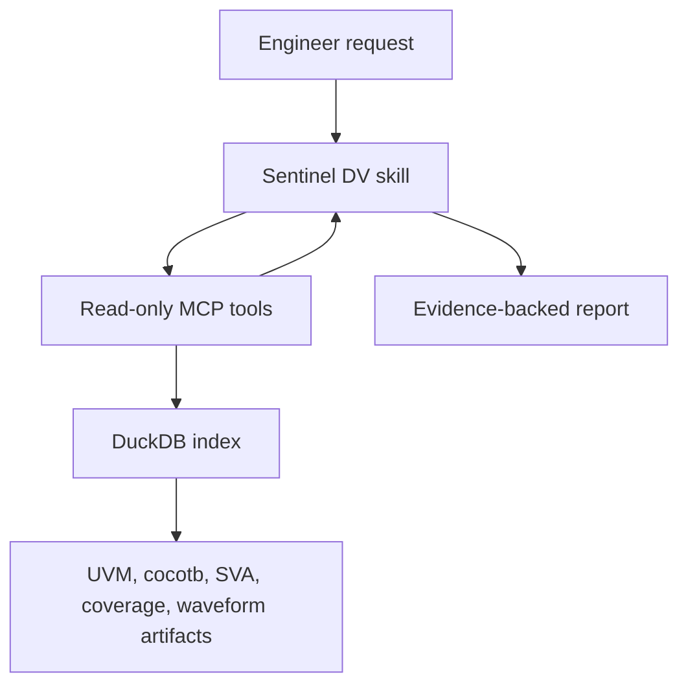

# Agent Skills

Sentinel DV ships focused skills for the three recurring verification workflows that benefit most from a stable tool sequence.

<div class="sdv-skill-list" markdown>

<section markdown>

## [Regression triage](regression-triage.md)

Assess a run, compare a baseline, cluster failures, and prioritize investigations.

`runs.*` · `regression.health` · `tests.cluster` · `failures.list`

</section>

<section markdown>

## [Failure debugging](failure-debugging.md)

Build a causal explanation for one failed test.

`tests.*` · `failures.list` · `assertions.*` · `wave.*`

</section>

<section markdown>

## [Coverage closure](coverage-closure.md)

Rank gaps, assess trend and vacuity, and plan measurable closure work.

`coverage.*` · `assertions.vacuity` · `runs.diff`

</section>

</div>

## Why skills and MCP are separate

The MCP server owns facts and controlled access. Skills own procedure:



This separation keeps tool outputs deterministic while allowing the workflow to evolve without embedding agent judgment in the server.

## Quality contract

Every skill:

- resolves stable IDs before detailed analysis;
- pages through the intended result scope;
- distinguishes observations from inference;
- treats missing data as unavailable, not as success;
- preserves evidence and truncation limits;
- treats generated commands and constraints as reviewable candidates;
- defines an explicit deliverable.

## Cross-agent packaging

`skills/` is canonical. `scripts/sync_agent_skills.py` copies it into `.agents/skills`, `.claude/skills`, and `.github/skills`. CI rejects drift between those locations.

```bash
.venv/bin/python scripts/sync_agent_skills.py --check
.venv/bin/python scripts/verify_skill_workflows.py
```

The workflow verifier indexes the checked-in demo corpus and exercises all three procedures. It is intentionally separate from `scripts/verify_all_mcp_tools.py`, which checks endpoint coverage for all 28 tools.

## Start here

1. Complete [Agent setup](../getting-started/agent-setup.md).
2. Verify `runs.list` from your MCP client.
3. Invoke the skill that matches the engineering question.
4. Include a run, suite, test name, baseline, protocol, or goal when known.
