# MCP tool gallery

!!! note "Auto-generated"
    Regenerate after demo or tool changes:
    ```bash
    python scripts/generate_mcp_tool_gallery.py
    ```

Visual cards below are produced from a real `demo/` index (multi-project).
Each image shows the **request arguments** and a **truncated JSON response**
exactly as MCP clients receive it (`schema_version` + payload or `error`).

[Open interactive HTML gallery](../assets/mcp-tools/gallery.html){ .md-button }

---

## `runs.list`

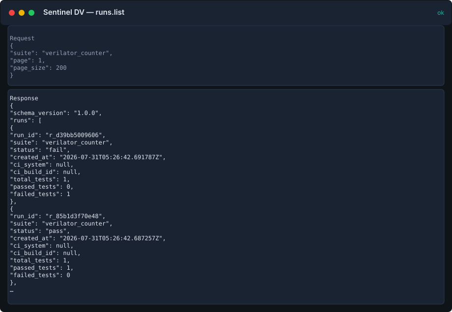

??? example "Request"
    ```json
    {
      "page": 1,
      "page_size": 200
    }
    ```

??? success "Response"
    ```json
    {
      "schema_version": "1.0.0",
      "runs": [
        {
          "run_id": "r_d39bb5009606",
          "suite": "verilator_counter",
          "status": "fail",
          "created_at": "2026-05-28T04:47:53.171676Z",
          "ci_system": null,
          "ci_build_id": null,
          "total_tests": 1,
          "passed_tests": 0,
          "failed_tests": 1
        },
        {
          "run_id": "r_85b1d3f70e48",
          "suite": "verilator_counter",
          "status": "pass",
          "created_at": "2026-05-28T04:47:53.168145Z",
          "ci_system": null,
          "ci_build_id": null,
          "total_tests": 1,
          "passed_tests": 1,
          "failed_tests": 0
        },
        {
          "run_id": "r_566fd6e9a21b",
          "suite": "verilator_counter",
          "status": "fail",
          "created_at": "2026-05-28T04:47:53.160940Z",
          "ci_system": null,
          "ci_build_id": null,
          "total_tests": 1,
          "passed_tests": 0,
          "failed_tests": 1
        },
        {
          "run_id": "r_2968fa34e74e",
          "suite": "axi_burst",
          "status": "fail",
          "created_at": "2026-05-28T04:47:53.152882Z",
          "ci_system": null,
          "ci_build_id": null,
          "total_tests": 1,
          "passed_tests": 0,
          "failed_tests": 1
        },
        {
          "run_id": "r_07d0f584403c",
          "suite": "apb_register",
          "status": "fail",
          "created_at": "2026-05-28T04:47:53.145575Z",
          "ci_system": null,
          "ci_build_id": null,
          "total_tests": 1,
          "passed_tests": 0,
          "failed_tests": 1
        },
        {
          "run_id": "r_c6f691e1ad14",
          "suite": "fifo_sync",
          "status": "fail",
          "created_at": "2026-05-28T04:47:53.137064Z",
          "ci_system": null,
          "ci_build_id": null,
          "total_tests": 2,
          "passed_tests": 1,
          "failed_tests": 1
        },
        {
          "run_id": "r_0fb765971a20",
          "suite": "counter_block",
          "status": "fail",
          "created_at": "2026-05-28T04:47:53.125239Z",
          "ci_system": null,
          "ci_build_id": null,
          "total_tests": 2,
          "passed_tests": 1,
          "failed_tests": 1
        },
        {
          "run_id": "r_26595f0640e8",
          "suite": "alu_core",
          "status": "fail",
          "created_at": "2026-05-28T04:47:53.110987Z",
          "ci_system": null,
          "ci_build_id": null,
          "total_tests": 2,
          "passed_tests": 1,
          "failed_tests": 1
        }
      ],
      "pagination": {
        "page": 1,
        "page_size": 200,
        "total_items": 8,
        "total_pages": 1
      }
    }
    ```

## `runs.get`

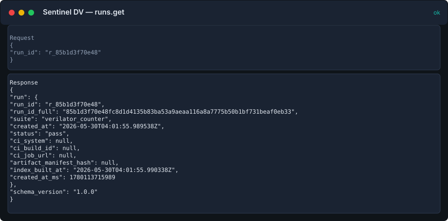

??? example "Request"
    ```json
    {
      "run_id": "r_85b1d3f70e48"
    }
    ```

??? success "Response"
    ```json
    {
      "run": {
        "run_id": "r_85b1d3f70e48",
        "run_id_full": "85b1d3f70e48fc8d1d4135b83ba53a9aeaa116a8a7775b50b1bf731beaf0eb33",
        "suite": "verilator_counter",
        "created_at": "2026-05-28T04:47:53.168145Z",
        "status": "pass",
        "ci_system": null,
        "ci_build_id": null,
        "ci_job_url": null,
        "artifact_manifest_hash": null,
        "index_built_at": "2026-05-28T04:47:53.168373Z"
      },
      "schema_version": "1.0.0"
    }
    ```

## `tests.list`

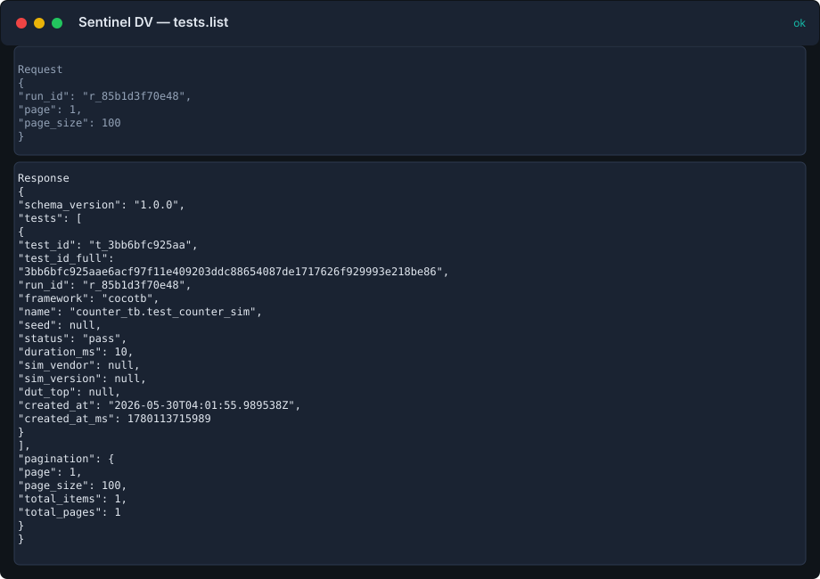

??? example "Request"
    ```json
    {
      "framework": "cocotb",
      "page": 1,
      "page_size": 100
    }
    ```

??? success "Response"
    ```json
    {
      "schema_version": "1.0.0",
      "tests": [
        {
          "test_id": "t_5b4ce57ba531",
          "test_id_full": "5b4ce57ba531ee67f628689f59aed7abf5d62399fc9b72274c231bc8c823a28a",
          "run_id": "r_d39bb5009606",
          "framework": "cocotb",
          "name": "counter_tb.test_counter_overflow",
          "seed": null,
          "status": "fail",
          "duration_ms": 20,
          "sim_vendor": null,
          "sim_version": null,
          "dut_top": null,
          "created_at": "2026-05-28T04:47:53.171676Z"
        },
        {
          "test_id": "t_3bb6bfc925aa",
          "test_id_full": "3bb6bfc925aae6acf97f11e409203ddc88654087de1717626f929993e218be86",
          "run_id": "r_85b1d3f70e48",
          "framework": "cocotb",
          "name": "counter_tb.test_counter_sim",
          "seed": null,
          "status": "pass",
          "duration_ms": 10,
          "sim_vendor": null,
          "sim_version": null,
          "dut_top": null,
          "created_at": "2026-05-28T04:47:53.168145Z"
        },
        {
          "test_id": "t_03ef102d00d0",
          "test_id_full": "03ef102d00d082f71282874371281d6572e81a5fdeb8609113608177d4513bc7",
          "run_id": "r_c6f691e1ad14",
          "framework": "cocotb",
          "name": "fifo_tb.test_fifo_push_pop",
          "seed": null,
          "status": "pass",
          "duration_ms": 20,
          "sim_vendor": null,
          "sim_version": null,
          "dut_top": null,
          "created_at": "2026-05-28T04:47:53.137064Z"
        },
        {
          "test_id": "t_cf16259fcc9e",
          "test_id_full": "cf16259fcc9ec9ad6cd0b3d90ba008eef3993c296dc3b8a7643bf19aa848e645",
          "run_id": "r_c6f691e1ad14",
          "framework": "cocotb",
          "name": "fifo_tb.test_fifo_underflow",
          "seed": null,
          "status": "fail",
          "duration_ms": 40,
          "sim_vendor": null,
          "sim_version": null,
          "dut_top": null,
          "created_at": "2026-05-28T04:47:53.137064Z"
        },
        {
          "test_id": "t_ce337fb0bfda",
          "test_id_full": "ce337fb0bfdaf2a1107f57cf190f51510e80976250f8ac03ab9d53fcd47c470d",
          "run_id": "r_0fb765971a20",
          "framework": "cocotb",
          "name": "test_counter.test_overflow",
          "seed": null,
          "status": "fail",
          "duration_ms": 75,
          "sim_vendor": null,
          "sim_version": null,
          "dut_top": null,
          "created_at": "2026-05-28T04:47:53.125239Z"
        },
        {
          "test_id": "t_f38bc388c919",
          "test_id_full": "f38bc388c91927c789a8da06454e7a551a19605edfe2b09855bd6b72d437189a",
          "run_id": "r_0fb765971a20",
          "framework": "cocotb",
          "name": "test_counter.test_increment",
          "seed": null,
          "status": "pass",
          "duration_ms": 50,
          "sim_vendor": null,
          "sim_version": null,
          "dut_top": null,
          "created_at": "2026-05-28T04:47:53.125239Z"
        },
        {
          "test_id": "t_dff9c20ec6c4",
          "test_id_full": "dff9c20ec6c48140d5a82bda6df56b434e33a43f442676e7bdb3d4dd8faed46d",
          "run_id": "r_26595f0640e8",
          "framework": "cocotb",
          "name": "alu_tb.test_alu_add",
          "seed": null,
          "status": "pass",
          "duration_ms": 30,
          "sim_vendor": null,
          "sim_version": null,
          "dut_top": null,
          "created_at": "2026-05-28T04:47:53.110987Z"
        },
        {
          "test_id": "t_fed229b40a64",
          "test_id_full": "fed229b40a64bd312385fc346e521d946382181b8656b4c9f9e742b4425eb074",
          "run_id": "r_26595f0640e8",
          "framework": "cocotb",
          "name": "alu_tb.test_alu_mul",
          "seed": null,
          "status": "fail",
          "duration_ms": 50,
          "sim_vendor": null,
          "sim_version": null,
          "dut_top": null,
          "created_at": "2026-05-28T04:47:53.110987Z"
        }
      ],
      "pagination": {
        "page": 1,
        "page_size": 100,
        "total_items": 8,
        "total_pages": 1
      }
    }
    ```

## `tests.get`

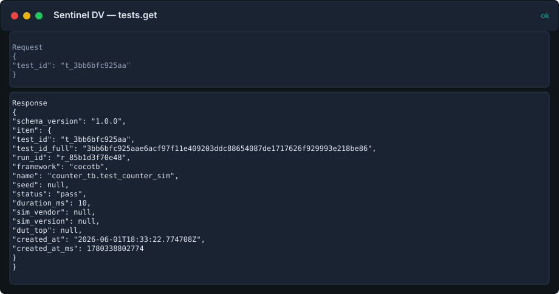

??? example "Request"
    ```json
    {
      "test_id": "t_dff9c20ec6c4"
    }
    ```

??? success "Response"
    ```json
    {
      "schema_version": "1.0.0",
      "item": {
        "test_id": "t_dff9c20ec6c4",
        "test_id_full": "dff9c20ec6c48140d5a82bda6df56b434e33a43f442676e7bdb3d4dd8faed46d",
        "run_id": "r_26595f0640e8",
        "framework": "cocotb",
        "name": "alu_tb.test_alu_add",
        "seed": null,
        "status": "pass",
        "duration_ms": 30,
        "sim_vendor": null,
        "sim_version": null,
        "dut_top": null,
        "created_at": "2026-05-28T04:47:53.110987Z"
      }
    }
    ```

## `tests.topology`

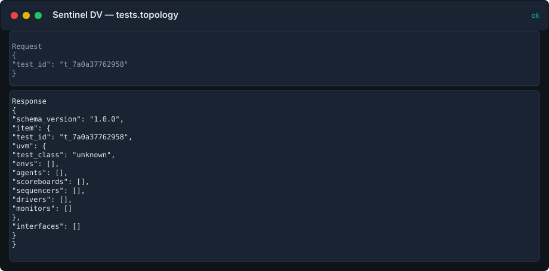

??? example "Request"
    ```json
    {
      "test_id": "t_7a0a37762958"
    }
    ```

??? success "Response"
    ```json
    {
      "schema_version": "1.0.0",
      "item": {
        "test_id": "t_7a0a37762958",
        "uvm": {
          "test_class": "unknown",
          "envs": [],
          "agents": [],
          "scoreboards": [],
          "sequencers": [],
          "drivers": [],
          "monitors": []
        },
        "interfaces": []
      }
    }
    ```

## `assertions.list`

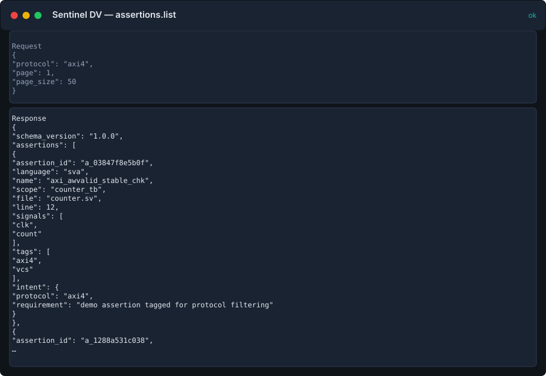

??? example "Request"
    ```json
    {
      "protocol": "axi4",
      "page": 1,
      "page_size": 50
    }
    ```

??? success "Response"
    ```json
    {
      "schema_version": "1.0.0",
      "assertions": [
        {
          "assertion_id": "a_1288a531c038",
          "language": "sva",
          "name": "axi_awvalid_stable_chk",
          "scope": "counter_tb",
          "file": "counter.sv",
          "line": 20,
          "signals": [
            "clk"
          ],
          "tags": [
            "axi4"
          ],
          "intent": {
            "protocol": "axi4",
            "requirement": "Demo protocol tag (illustrative)"
          }
        }
      ],
      "pagination": {
        "page": 1,
        "page_size": 50,
        "total_items": 1,
        "total_pages": 1
      }
    }
    ```

## `assertions.get`

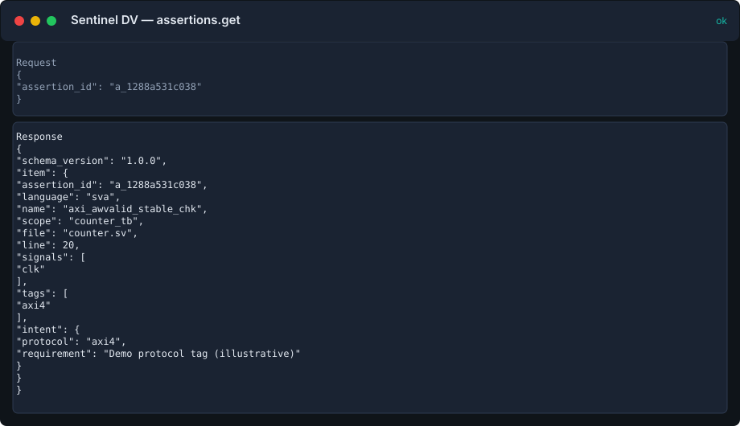

??? example "Request"
    ```json
    {
      "assertion_id": "a_1288a531c038"
    }
    ```

??? success "Response"
    ```json
    {
      "schema_version": "1.0.0",
      "item": {
        "assertion_id": "a_1288a531c038",
        "language": "sva",
        "name": "axi_awvalid_stable_chk",
        "scope": "counter_tb",
        "file": "counter.sv",
        "line": 20,
        "signals": [
          "clk"
        ],
        "tags": [
          "axi4"
        ],
        "intent": {
          "protocol": "axi4",
          "requirement": "Demo protocol tag (illustrative)"
        }
      }
    }
    ```

## `assertions.failures`

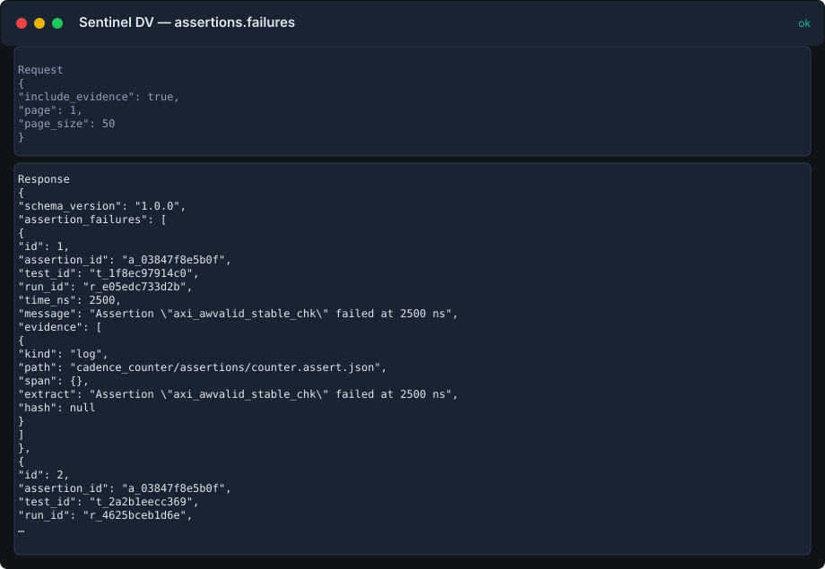

??? example "Request"
    ```json
    {
      "include_evidence": true,
      "page": 1,
      "page_size": 50
    }
    ```

??? success "Response"
    ```json
    {
      "schema_version": "1.0.0",
      "assertion_failures": [
        {
          "id": 1,
          "assertion_id": "a_c00ae0788840",
          "test_id": "t_3bb6bfc925aa",
          "run_id": "r_85b1d3f70e48",
          "time_ns": 2500,
          "message": "count changed while rst asserted",
          "evidence": [
            {
              "kind": "log",
              "path": "verilator_counter/assertions/counter_fail.assert.json",
              "span": {},
              "extract": "count changed while rst asserted",
              "hash": null
            }
          ]
        }
      ],
      "pagination": {
        "page": 1,
        "page_size": 50,
        "total_items": 1,
        "total_pages": 1
      }
    }
    ```

## `coverage.list`

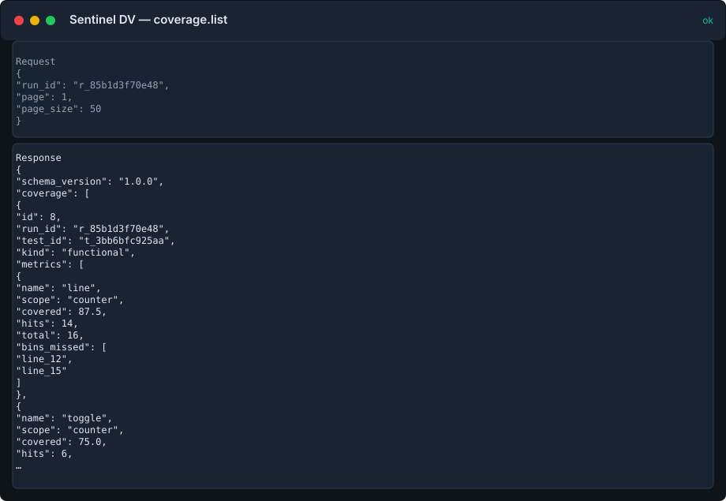

??? example "Request"
    ```json
    {
      "run_id": "r_85b1d3f70e48",
      "page": 1,
      "page_size": 50
    }
    ```

??? success "Response"
    ```json
    {
      "schema_version": "1.0.0",
      "coverage": [
        {
          "id": 1,
          "run_id": "r_85b1d3f70e48",
          "test_id": "t_3bb6bfc925aa",
          "kind": "functional",
          "metrics": [
            {
              "name": "line",
              "scope": "counter",
              "covered": 87.5,
              "hits": 14,
              "total": 16,
              "bins_missed": [
                "line_12",
                "line_15"
              ]
            },
            {
              "name": "toggle",
              "scope": "counter",
              "covered": 75.0,
              "hits": 6,
              "total": 8
            }
          ],
          "evidence": [
            {
              "kind": "coverage",
              "path": "verilator_counter/coverage/coverage.json"
            }
          ]
        }
      ],
      "pagination": {
        "page": 1,
        "page_size": 50,
        "total_items": 1,
        "total_pages": 1
      }
    }
    ```

## `coverage.summary`

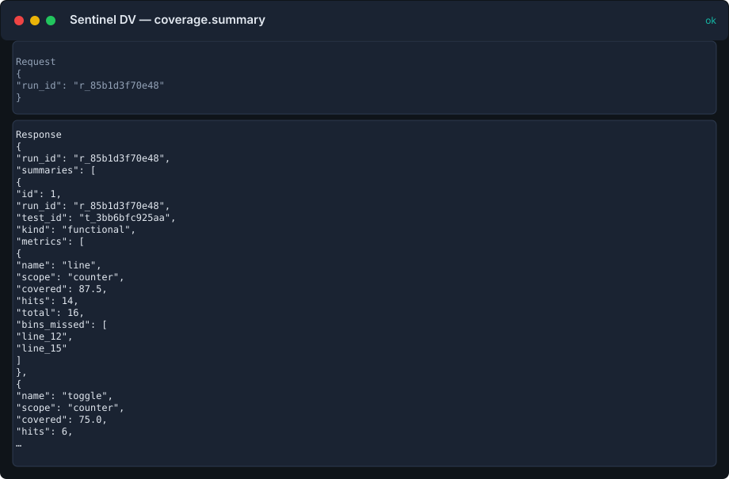

??? example "Request"
    ```json
    {
      "run_id": "r_85b1d3f70e48"
    }
    ```

??? success "Response"
    ```json
    {
      "run_id": "r_85b1d3f70e48",
      "summaries": [
        {
          "id": 1,
          "run_id": "r_85b1d3f70e48",
          "test_id": "t_3bb6bfc925aa",
          "kind": "functional",
          "metrics": [
            {
              "name": "line",
              "scope": "counter",
              "covered": 87.5,
              "hits": 14,
              "total": 16,
              "bins_missed": [
                "line_12",
                "line_15"
              ]
            },
            {
              "name": "toggle",
              "scope": "counter",
              "covered": 75.0,
              "hits": 6,
              "total": 8
            }
          ]
        }
      ],
      "total_summaries": 1,
      "truncated": false,
      "schema_version": "1.0.0"
    }
    ```

## `failures.list`

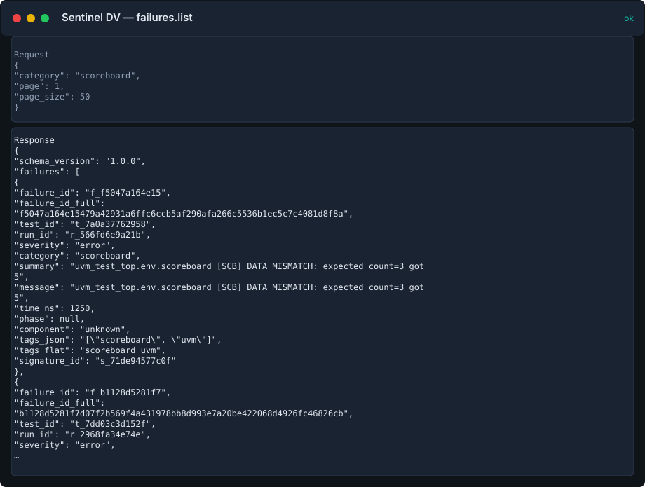

??? example "Request"
    ```json
    {
      "category": "scoreboard",
      "page": 1,
      "page_size": 50
    }
    ```

??? success "Response"
    ```json
    {
      "schema_version": "1.0.0",
      "failures": [
        {
          "failure_id": "f_f5047a164e15",
          "failure_id_full": "f5047a164e15479a42931a6ffc6ccb5af290afa266c5536b1ec5c7c4081d8f8a",
          "test_id": "t_7a0a37762958",
          "run_id": "r_566fd6e9a21b",
          "severity": "error",
          "category": "scoreboard",
          "summary": "uvm_test_top.env.scoreboard [SCB] DATA MISMATCH: expected count=3 got 5",
          "message": "uvm_test_top.env.scoreboard [SCB] DATA MISMATCH: expected count=3 got 5",
          "time_ns": 1250,
          "phase": null,
          "component": "unknown",
          "tags_json": "[\"scoreboard\", \"uvm\"]",
          "tags_flat": "scoreboard uvm",
          "signature_id": "s_71de94577c0f"
        },
        {
          "failure_id": "f_b1128d5281f7",
          "failure_id_full": "b1128d5281f7d07f2b569f4a431978bb8d993e7a20be422068d4926fc46826cb",
          "test_id": "t_7dd03c3d152f",
          "run_id": "r_2968fa34e74e",
          "severity": "error",
          "category": "scoreboard",
          "summary": "uvm_test_top.axi_env.scoreboard [SCB] AXI DATA MISMATCH: AW beat 3 expected 0xDEAD got 0xBEEF",
          "message": "uvm_test_top.axi_env.scoreboard [SCB] AXI DATA MISMATCH: AW beat 3 expected 0xDEAD got 0xBEEF",
          "time_ns": 850,
          "phase": null,
          "component": "unknown",
          "tags_json": "[\"scoreboard\", \"uvm\", \"axi4\"]",
          "tags_flat": "scoreboard uvm axi4",
          "signature_id": "s_accaf1efb76e"
        }
      ],
      "pagination": {
        "page": 1,
        "page_size": 50,
        "total_items": 2,
        "total_pages": 1
      }
    }
    ```

## `regressions.summary`

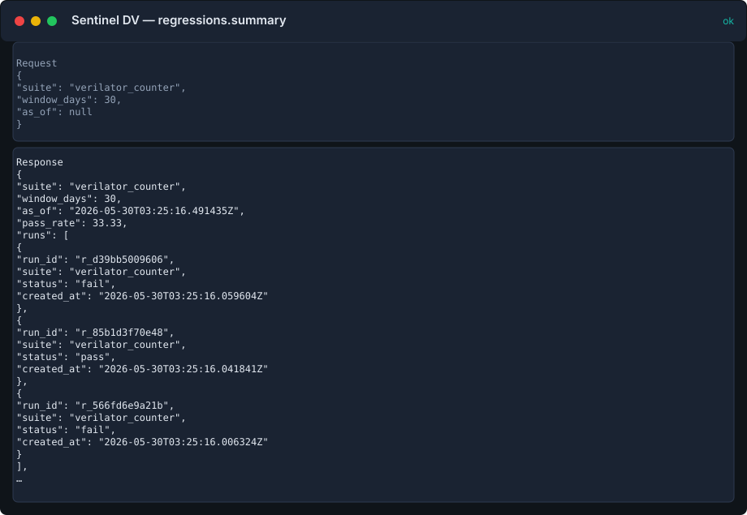

??? example "Request"
    ```json
    {
      "suite": "axi_burst",
      "window_days": 30,
      "as_of": "2026-05-28T12:00:00Z"
    }
    ```

??? success "Response"
    ```json
    {
      "suite": "axi_burst",
      "window_days": 30,
      "as_of": "2026-05-28T12:00:00Z",
      "pass_rate": 0.0,
      "runs": [
        {
          "run_id": "r_2968fa34e74e",
          "suite": "axi_burst",
          "status": "fail",
          "created_at": "2026-05-28T04:47:53.152882Z"
        }
      ],
      "top_signatures": [
        {
          "signature_id": "s_accaf1efb76e",
          "category": "scoreboard",
          "summary": "uvm_test_top.axi_env.scoreboard [SCB] AXI DATA MISMATCH: AW beat 3 expected 0xDEAD got 0xBEEF",
          "count": 1
        }
      ],
      "schema_version": "1.0.0"
    }
    ```

## `runs.diff`

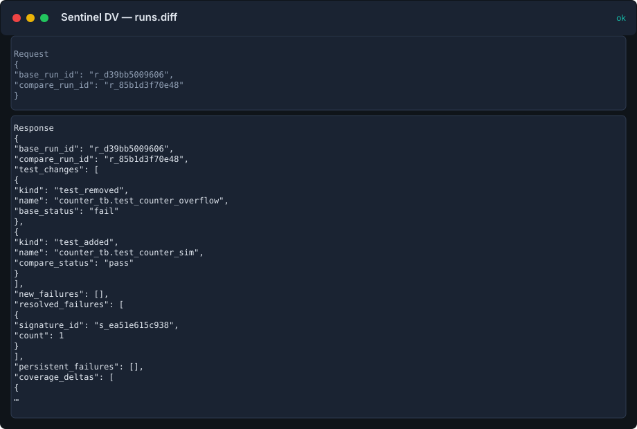

??? example "Request"
    ```json
    {
      "base_run_id": "r_d39bb5009606",
      "compare_run_id": "r_85b1d3f70e48"
    }
    ```

??? success "Response"
    ```json
    {
      "base_run_id": "r_d39bb5009606",
      "compare_run_id": "r_85b1d3f70e48",
      "test_changes": [
        {
          "kind": "test_removed",
          "name": "counter_tb.test_counter_overflow",
          "base_status": "fail"
        },
        {
          "kind": "test_added",
          "name": "counter_tb.test_counter_sim",
          "compare_status": "pass"
        }
      ],
      "new_failures": [],
      "resolved_failures": [
        {
          "signature_id": "s_ea51e615c938",
          "count": 1
        }
      ],
      "schema_version": "1.0.0"
    }
    ```

## `wave.signals`

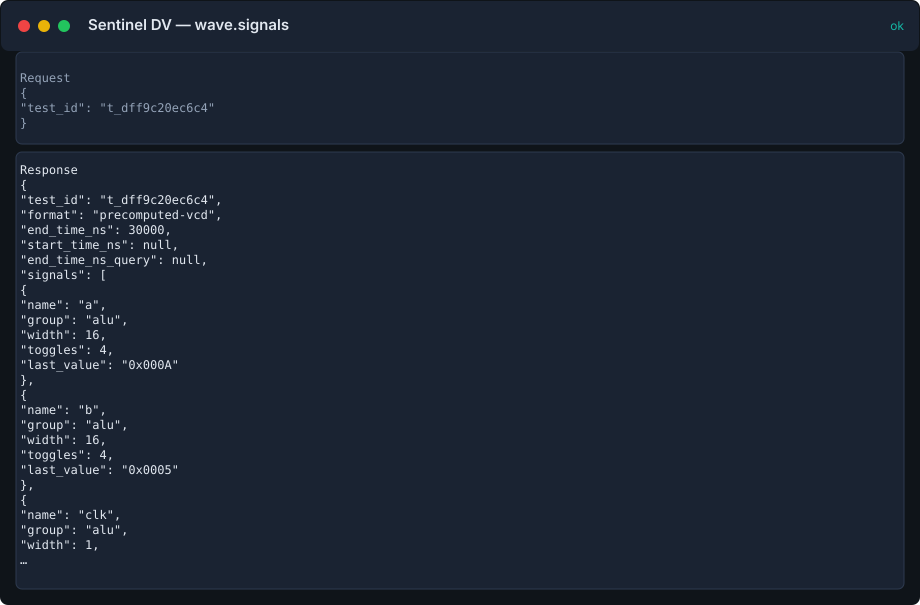

??? example "Request"
    ```json
    {
      "test_id": "t_dff9c20ec6c4"
    }
    ```

??? success "Response"
    ```json
    {
      "test_id": "t_dff9c20ec6c4",
      "format": "precomputed-vcd",
      "end_time_ns": 30000,
      "start_time_ns": null,
      "end_time_ns_query": null,
      "signals": [
        {
          "name": "a",
          "group": "alu",
          "width": 16,
          "toggles": 4,
          "last_value": "0x000A"
        },
        {
          "name": "b",
          "group": "alu",
          "width": 16,
          "toggles": 4,
          "last_value": "0x0005"
        },
        {
          "name": "clk",
          "group": "alu",
          "width": 1,
          "toggles": 60,
          "last_value": "1"
        },
        {
          "name": "sum",
          "group": "alu",
          "width": 16,
          "toggles": 2,
          "last_value": "0x000F"
        }
      ],
      "signal_count": 4,
      "truncated": false,
      "source_path": "waveforms/alu_core/test_alu_add.wave.json",
      "schema_version": "1.0.0"
    }
    ```

## `wave.summary`

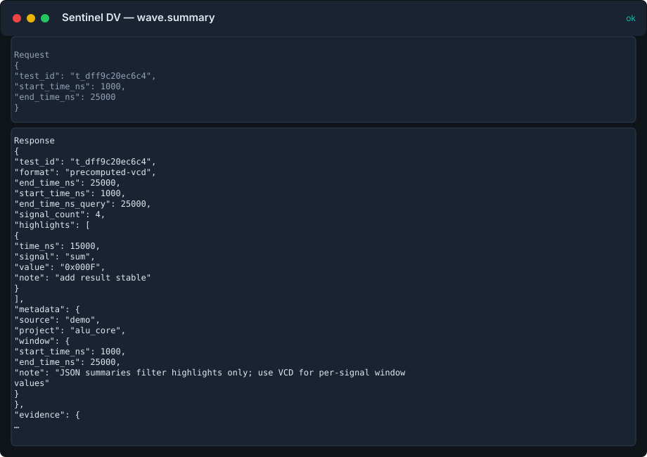

??? example "Request"
    ```json
    {
      "test_id": "t_dff9c20ec6c4",
      "start_time_ns": 1000,
      "end_time_ns": 25000
    }
    ```

??? success "Response"
    ```json
    {
      "test_id": "t_dff9c20ec6c4",
      "format": "precomputed-vcd",
      "end_time_ns": 25000,
      "start_time_ns": 1000,
      "end_time_ns_query": 25000,
      "signal_count": 4,
      "highlights": [
        {
          "time_ns": 15000,
          "signal": "sum",
          "value": "0x000F",
          "note": "add result stable"
        }
      ],
      "metadata": {
        "source": "demo",
        "project": "alu_core",
        "window": {
          "start_time_ns": 1000,
          "end_time_ns": 25000,
          "note": "JSON summaries filter highlights only; use VCD for per-signal window values"
        }
      },
      "evidence": {
        "kind": "waveform_summary",
        "path": "waveforms/alu_core/test_alu_add.wave.json"
      },
      "source_path": "waveforms/alu_core/test_alu_add.wave.json",
      "schema_version": "1.0.0"
    }
    ```
