# MCP tool gallery

!!! note "Auto-generated"
    Regenerate after demo or tool changes:
    ```bash
    python scripts/generate_mcp_tool_gallery.py
    ```

Visual cards below are produced from a real `demo/` index (multi-project).
Each image shows the **request arguments** and a **truncated JSON response**
exactly as MCP clients receive it (`schema_version` + payload or `error`).

[Open interactive HTML gallery](../assets/mcp-tools/gallery.html){ .md-button }

---

## `runs.list`


??? example "Request"
    ```json
    {
      "suite": "verilator_counter",
      "page": 1,
      "page_size": 200
    }
    ```

??? success "Response"
    ```json
    {
      "schema_version": "1.0.0",
      "runs": [
        {
          "run_id": "r_d39bb5009606",
          "suite": "verilator_counter",
          "status": "fail",
          "created_at": "2026-07-31T05:26:42.691787Z",
          "ci_system": null,
          "ci_build_id": null,
          "total_tests": 1,
          "passed_tests": 0,
          "failed_tests": 1
        },
        {
          "run_id": "r_85b1d3f70e48",
          "suite": "verilator_counter",
          "status": "pass",
          "created_at": "2026-07-31T05:26:42.687257Z",
          "ci_system": null,
          "ci_build_id": null,
          "total_tests": 1,
          "passed_tests": 1,
          "failed_tests": 0
        },
        {
          "run_id": "r_566fd6e9a21b",
          "suite": "verilator_counter",
          "status": "fail",
          "created_at": "2026-07-31T05:26:42.678688Z",
          "ci_system": null,
          "ci_build_id": null,
          "total_tests": 1,
          "passed_tests": 0,
          "failed_tests": 1
        }
      ],
      "pagination": {
        "page": 1,
        "page_size": 200,
        "total_items": 3,
        "total_pages": 1
      }
    }
    ```

## `runs.get`


??? example "Request"
    ```json
    {
      "run_id": "r_85b1d3f70e48"
    }
    ```

??? success "Response"
    ```json
    {
      "run": {
        "run_id": "r_85b1d3f70e48",
        "run_id_full": "85b1d3f70e48fc8d1d4135b83ba53a9aeaa116a8a7775b50b1bf731beaf0eb33",
        "suite": "verilator_counter",
        "created_at": "2026-07-31T05:26:42.687257Z",
        "status": "pass",
        "ci_system": null,
        "ci_build_id": null,
        "ci_job_url": null,
        "artifact_manifest_hash": null,
        "index_built_at": "2026-07-31T05:26:42.687537Z",
        "created_at_ms": 1785475602687
      },
      "schema_version": "1.0.0"
    }
    ```

## `runs.summary`

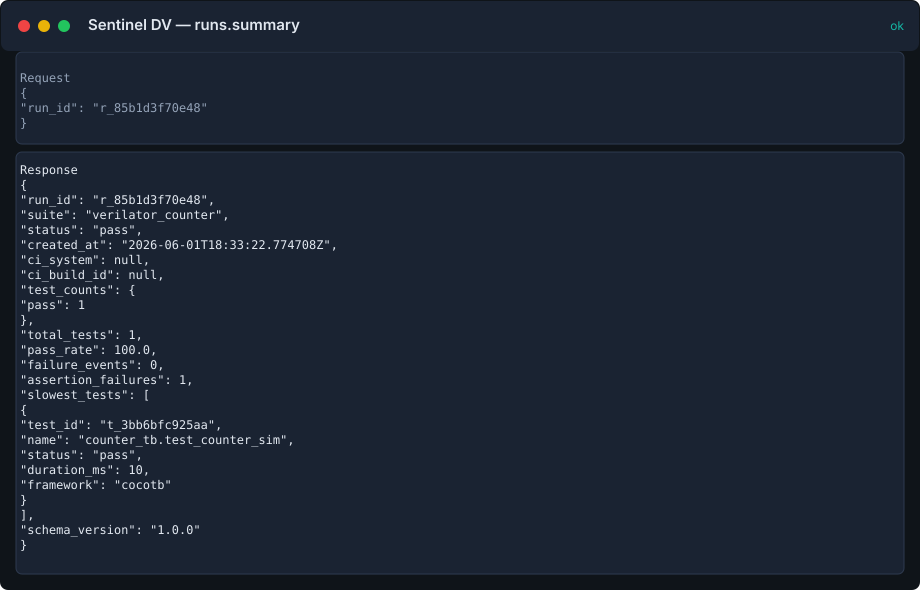

??? example "Request"
    ```json
    {
      "run_id": "r_85b1d3f70e48"
    }
    ```

??? success "Response"
    ```json
    {
      "run_id": "r_85b1d3f70e48",
      "suite": "verilator_counter",
      "status": "pass",
      "created_at": "2026-07-31T05:26:42.687257Z",
      "ci_system": null,
      "ci_build_id": null,
      "test_counts": {
        "pass": 1
      },
      "total_tests": 1,
      "pass_rate": 100.0,
      "failure_events": 0,
      "assertion_failures": 1,
      "slowest_tests": [
        {
          "test_id": "t_3bb6bfc925aa",
          "name": "counter_tb.test_counter_sim",
          "status": "pass",
          "duration_ms": 10,
          "framework": "cocotb"
        }
      ],
      "schema_version": "1.0.0"
    }
    ```

## `runs.submit`

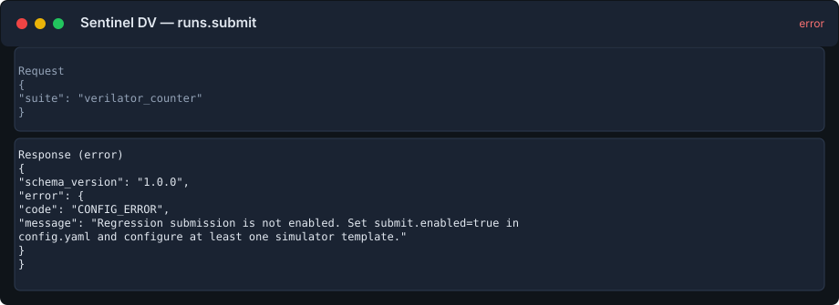

??? example "Request"
    ```json
    {
      "suite": "verilator_counter"
    }
    ```

??? success "Response"
    ```json
    {
      "schema_version": "1.0.0",
      "error": {
        "code": "CONFIG_ERROR",
        "message": "Regression submission is not enabled. Set submit.enabled=true in config.yaml and configure at least one simulator template."
      }
    }
    ```

## `tests.list`


??? example "Request"
    ```json
    {
      "run_id": "r_85b1d3f70e48",
      "page": 1,
      "page_size": 100
    }
    ```

??? success "Response"
    ```json
    {
      "schema_version": "1.0.0",
      "tests": [
        {
          "test_id": "t_3bb6bfc925aa",
          "test_id_full": "3bb6bfc925aae6acf97f11e409203ddc88654087de1717626f929993e218be86",
          "run_id": "r_85b1d3f70e48",
          "framework": "cocotb",
          "name": "counter_tb.test_counter_sim",
          "seed": null,
          "status": "pass",
          "duration_ms": 10,
          "sim_vendor": null,
          "sim_version": null,
          "dut_top": null,
          "created_at": "2026-07-31T05:26:42.687257Z",
          "created_at_ms": 1785475602687
        }
      ],
      "pagination": {
        "page": 1,
        "page_size": 100,
        "total_items": 1,
        "total_pages": 1
      }
    }
    ```

## `tests.get`


??? example "Request"
    ```json
    {
      "test_id": "t_3bb6bfc925aa"
    }
    ```

??? success "Response"
    ```json
    {
      "schema_version": "1.0.0",
      "item": {
        "test_id": "t_3bb6bfc925aa",
        "test_id_full": "3bb6bfc925aae6acf97f11e409203ddc88654087de1717626f929993e218be86",
        "run_id": "r_85b1d3f70e48",
        "framework": "cocotb",
        "name": "counter_tb.test_counter_sim",
        "seed": null,
        "status": "pass",
        "duration_ms": 10,
        "sim_vendor": null,
        "sim_version": null,
        "dut_top": null,
        "created_at": "2026-07-31T05:26:42.687257Z",
        "created_at_ms": 1785475602687
      }
    }
    ```

## `tests.history`

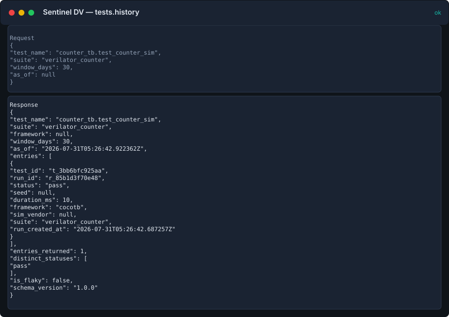

??? example "Request"
    ```json
    {
      "test_name": "counter_tb.test_counter_sim",
      "suite": "verilator_counter",
      "window_days": 30,
      "as_of": null
    }
    ```

??? success "Response"
    ```json
    {
      "test_name": "counter_tb.test_counter_sim",
      "suite": "verilator_counter",
      "framework": null,
      "window_days": 30,
      "as_of": "2026-07-31T05:26:42.922362Z",
      "entries": [
        {
          "test_id": "t_3bb6bfc925aa",
          "run_id": "r_85b1d3f70e48",
          "status": "pass",
          "seed": null,
          "duration_ms": 10,
          "framework": "cocotb",
          "sim_vendor": null,
          "suite": "verilator_counter",
          "run_created_at": "2026-07-31T05:26:42.687257Z"
        }
      ],
      "entries_returned": 1,
      "distinct_statuses": [
        "pass"
      ],
      "is_flaky": false,
      "schema_version": "1.0.0"
    }
    ```

## `tests.topology`


??? example "Request"
    ```json
    {
      "test_id": "t_7a0a37762958"
    }
    ```

??? success "Response"
    ```json
    {
      "schema_version": "1.0.0",
      "item": {
        "test_id": "t_7a0a37762958",
        "uvm": {
          "test_class": "unknown",
          "envs": [],
          "agents": [],
          "scoreboards": [],
          "sequencers": [],
          "drivers": [],
          "monitors": []
        },
        "interfaces": []
      }
    }
    ```

## `tests.replay`

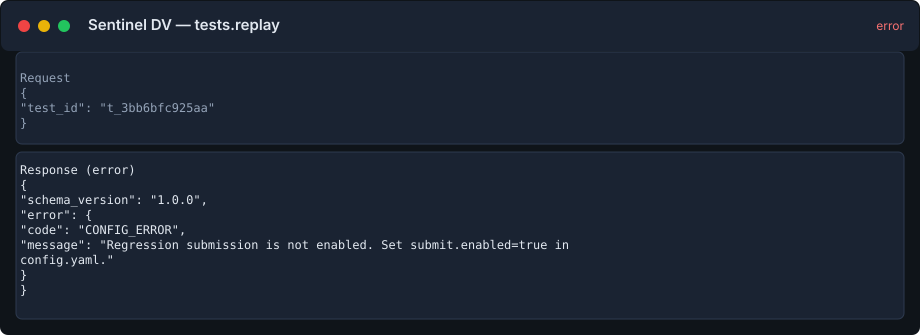

??? example "Request"
    ```json
    {
      "test_id": "t_3bb6bfc925aa"
    }
    ```

??? success "Response"
    ```json
    {
      "schema_version": "1.0.0",
      "error": {
        "code": "CONFIG_ERROR",
        "message": "Regression submission is not enabled. Set submit.enabled=true in config.yaml."
      }
    }
    ```

## `assertions.list`


??? example "Request"
    ```json
    {
      "protocol": "axi4",
      "page": 1,
      "page_size": 50
    }
    ```

??? success "Response"
    ```json
    {
      "schema_version": "1.0.0",
      "assertions": [
        {
          "assertion_id": "a_c0ae7a3d319c",
          "language": "sva",
          "name": "CHK_ARVALID_STABLE",
          "scope": "axi4_tb_top.dut",
          "file": "axi4_slave.sv",
          "line": 146,
          "signals": [
            "ACLK",
            "ARESETn",
            "ARVALID",
            "ARREADY"
          ],
          "tags": [
            "axi4",
            "handshake",
            "protocol",
            "read-address"
          ],
          "intent": {
            "protocol": "axi4",
            "requirement": "AXI4 spec \u00a7A3.2.1: master must not de-assert ARVALID before the handshake"
          }
        },
        {
          "assertion_id": "a_11ed387e66f6",
          "language": "sva",
          "name": "CHK_AWVALID_STABLE",
          "scope": "axi4_tb_top.dut",
          "file": "axi4_slave.sv",
          "line": 138,
          "signals": [
            "ACLK",
            "ARESETn",
            "AWVALID",
            "AWREADY"
          ],
          "tags": [
            "axi4",
            "handshake",
            "protocol",
            "write-address"
          ],
          "intent": {
            "protocol": "axi4",
            "requirement": "AXI4 spec \u00a7A3.2.1: master must not de-assert AWVALID before the handshake"
          }
        },
        {
          "assertion_id": "a_39857bc021fc",
          "language": "sva",
          "name": "CHK_BRESP_ACCEPTED",
          "scope": "axi4_tb_top.dut",
          "file": "axi4_slave.sv",
          "line": 162,
          "signals": [
            "ACLK",
            "ARESETn",
            "BVALID",
            "BREADY"
          ],
          "tags": [
            "axi4",
            "protocol",
            "timeout",
            "write-response"
          ],
          "intent": {
            "protocol": "axi4",
            "requirement": "AXI4 compliance: BVALID must be accepted within a bounded number of cycles"
          }
        },
        {
          "assertion_id": "a_825670dc11bc",
          "language": "sva",
          "name": "CHK_RESP_AFTER_DATA",
          "scope": "axi4_tb_top.dut",
          "file": "axi4_slave.sv",
          "line": 178,
          "signals": [
            "ACLK",
            "ARESETn",
            "wstate",
            "wbeat_cnt"
          ],
          "tags": [
            "axi4",
            "ordering",
            "protocol",
            "write-response"
          ],
          "intent": {
            "protocol": "axi4",
            "requirement": "Write response must only be issued after at least one write data beat has occurred"
          }
        },
        {
          "assertion_id": "a_6548339b9337",
          "language": "sva",
          "name": "CHK_RLAST_ON_FINAL",
          "scope": "axi4_tb_top.dut",
          "file": "axi4_slave.sv",
          "line": 170,
          "signals": [
            "ACLK",
            "ARESETn",
            "RVALID",
            "RREADY",
            "RLAST",
            "rbeat_cnt",
            "rlen_q"
          ],
          "tags": [
            "axi4",
            "burst",
            "protocol",
            "read"
          ],
          "intent": {
            "protocol": "axi4",
            "requirement": "AXI4 spec \u00a7A3.4.3: RLAST must be asserted on the final data beat of a read burst"
          }
        },
        {
          "assertion_id": "a_fe48551b6a35",
          "language": "sva",
          "name": "CHK_WVALID_STABLE",
          "scope": "axi4_tb_top.dut",
          "file": "axi4_slave.sv",
          "line": 154,
          "signals": [
            "ACLK",
            "ARESETn",
            "WVALID",
            "WREADY"
          ],
          "tags": [
            "axi4",
            "handshake",
            "protocol",
            "write-data"
          ],
          "intent": {
            "protocol": "axi4",
            "requirement": "AXI4 spec \u00a7A3.2.1: WVALID must not drop without handshake during a burst"
          }
        },
        {
          "assertion_id": "a_03847f8e5b0f",
          "language": "sva",
          "name": "axi_awvalid_stable_chk",
          "scope": "counter_tb",
          "file": "counter.sv",
          "line": 12,
          "signals": [
            "clk",
            "count"
          ],
          "tags": [
            "axi4",
            "vcs"
          ],
          "intent": {
            "protocol": "axi4",
            "requirement": "demo assertion tagged for protocol filtering"
          }
        },
        {
          "assertion_id": "a_1288a531c038",
          "language": "sva",
          "name": "axi_awvalid_stable_chk",
          "scope": "counter_tb",
          "file": "counter.sv",
          "line": 20,
          "signals": [
            "clk"
          ],
          "tags": [
            "axi4"
          ],
          "intent": {
            "protocol": "axi4",
            "requirement": "Demo protocol tag (illustrative)"
          }
        }
      ],
      "pagination": {
        "page": 1,
        "page_size": 50,
        "total_items": 8,
        "total_pages": 1
      }
    }
    ```

## `assertions.get`


??? example "Request"
    ```json
    {
      "assertion_id": "a_c0ae7a3d319c"
    }
    ```

??? success "Response"
    ```json
    {
      "schema_version": "1.0.0",
      "item": {
        "assertion_id": "a_c0ae7a3d319c",
        "language": "sva",
        "name": "CHK_ARVALID_STABLE",
        "scope": "axi4_tb_top.dut",
        "file": "axi4_slave.sv",
        "line": 146,
        "signals": [
          "ACLK",
          "ARESETn",
          "ARVALID",
          "ARREADY"
        ],
        "tags": [
          "axi4",
          "handshake",
          "protocol",
          "read-address"
        ],
        "intent": {
          "protocol": "axi4",
          "requirement": "AXI4 spec \u00a7A3.2.1: master must not de-assert ARVALID before the handshake"
        }
      }
    }
    ```

## `assertions.failures`


??? example "Request"
    ```json
    {
      "include_evidence": true,
      "page": 1,
      "page_size": 50
    }
    ```

??? success "Response"
    ```json
    {
      "schema_version": "1.0.0",
      "assertion_failures": [
        {
          "id": 1,
          "assertion_id": "a_39857bc021fc",
          "test_id": "t_b439c1f1e40d",
          "run_id": "r_e0e82e0b1722",
          "time_ns": 1248000,
          "message": "Assertion \"CHK_BRESP_ACCEPTED\" failed at time 1248000ns \u2014 BVALID not accepted within 16 cycles (master held BREADY low)",
          "evidence": [
            {
              "kind": "log",
              "path": "axi4_uvm/vcs/assertions/axi4_error_resp.assert.json",
              "span": {},
              "extract": "Assertion \"CHK_BRESP_ACCEPTED\" failed at time 1248000ns \u2014 BVALID not accepted within 16 cycles (master held BREADY low)",
              "hash": null
            }
          ]
        },
        {
          "id": 2,
          "assertion_id": "a_03847f8e5b0f",
          "test_id": "t_1f8ec97914c0",
          "run_id": "r_e05edc733d2b",
          "time_ns": 2500,
          "message": "Assertion \"axi_awvalid_stable_chk\" failed at 2500 ns",
          "evidence": [
            {
              "kind": "log",
              "path": "cadence_counter/assertions/counter.assert.json",
              "span": {},
              "extract": "Assertion \"axi_awvalid_stable_chk\" failed at 2500 ns",
              "hash": null
            }
          ]
        },
        {
          "id": 3,
          "assertion_id": "a_03847f8e5b0f",
          "test_id": "t_2a2b1eecc369",
          "run_id": "r_4625bceb1d6e",
          "time_ns": 2500,
          "message": "Assertion \"axi_awvalid_stable_chk\" failed at 2500 ns",
          "evidence": [
            {
              "kind": "log",
              "path": "questa_counter/assertions/counter.assert.json",
              "span": {},
              "extract": "Assertion \"axi_awvalid_stable_chk\" failed at 2500 ns",
              "hash": null
            }
          ]
        },
        {
          "id": 4,
          "assertion_id": "a_03847f8e5b0f",
          "test_id": "t_ed09d88e1f1a",
          "run_id": "r_8f85ecd85936",
          "time_ns": 2500,
          "message": "Assertion \"axi_awvalid_stable_chk\" failed at 2500 ns",
          "evidence": [
            {
              "kind": "log",
              "path": "vcs_counter/assertions/counter.assert.json",
              "span": {},
              "extract": "Assertion \"axi_awvalid_stable_chk\" failed at 2500 ns",
              "hash": null
            }
          ]
        },
        {
          "id": 5,
          "assertion_id": "a_c00ae0788840",
          "test_id": "t_3bb6bfc925aa",
          "run_id": "r_85b1d3f70e48",
          "time_ns": 2500,
          "message": "count changed while rst asserted",
          "evidence": [
            {
              "kind": "log",
              "path": "verilator_counter/assertions/counter_fail.assert.json",
              "span": {},
              "extract": "count changed while rst asserted",
              "hash": null
            }
          ]
        }
      ],
      "pagination": {
        "page": 1,
        "page_size": 50,
        "total_items": 5,
        "total_pages": 1
      }
    }
    ```

## `assertions.sva_status`

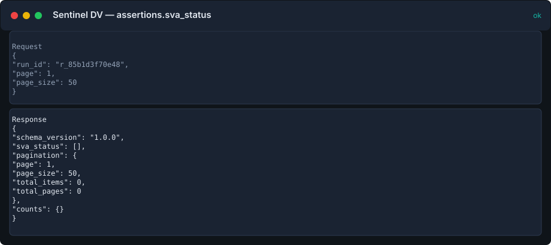

??? example "Request"
    ```json
    {
      "run_id": "r_85b1d3f70e48",
      "page": 1,
      "page_size": 50
    }
    ```

??? success "Response"
    ```json
    {
      "schema_version": "1.0.0",
      "sva_status": [],
      "pagination": {
        "page": 1,
        "page_size": 50,
        "total_items": 0,
        "total_pages": 0
      },
      "counts": {}
    }
    ```

## `assertions.vacuity`

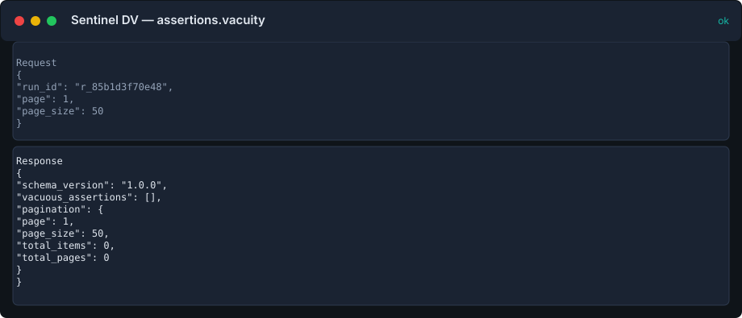

??? example "Request"
    ```json
    {
      "run_id": "r_85b1d3f70e48",
      "page": 1,
      "page_size": 50
    }
    ```

??? success "Response"
    ```json
    {
      "schema_version": "1.0.0",
      "vacuous_assertions": [],
      "pagination": {
        "page": 1,
        "page_size": 50,
        "total_items": 0,
        "total_pages": 0
      }
    }
    ```

## `coverage.list`


??? example "Request"
    ```json
    {
      "run_id": "r_85b1d3f70e48",
      "page": 1,
      "page_size": 50
    }
    ```

??? success "Response"
    ```json
    {
      "schema_version": "1.0.0",
      "coverage": [
        {
          "id": 8,
          "run_id": "r_85b1d3f70e48",
          "test_id": "t_3bb6bfc925aa",
          "kind": "functional",
          "metrics": [
            {
              "name": "line",
              "scope": "counter",
              "covered": 87.5,
              "hits": 14,
              "total": 16,
              "bins_missed": [
                "line_12",
                "line_15"
              ]
            },
            {
              "name": "toggle",
              "scope": "counter",
              "covered": 75.0,
              "hits": 6,
              "total": 8
            }
          ],
          "evidence": [
            {
              "kind": "coverage",
              "path": "verilator_counter/coverage/coverage.json",
              "span": null,
              "extract": null,
              "hash": null
            }
          ]
        }
      ],
      "pagination": {
        "page": 1,
        "page_size": 50,
        "total_items": 1,
        "total_pages": 1
      }
    }
    ```

## `coverage.summary`


??? example "Request"
    ```json
    {
      "run_id": "r_85b1d3f70e48"
    }
    ```

??? success "Response"
    ```json
    {
      "run_id": "r_85b1d3f70e48",
      "summaries": [
        {
          "id": 8,
          "run_id": "r_85b1d3f70e48",
          "test_id": "t_3bb6bfc925aa",
          "kind": "functional",
          "metrics": [
            {
              "name": "line",
              "scope": "counter",
              "covered": 87.5,
              "hits": 14,
              "total": 16,
              "bins_missed": [
                "line_12",
                "line_15"
              ]
            },
            {
              "name": "toggle",
              "scope": "counter",
              "covered": 75.0,
              "hits": 6,
              "total": 8
            }
          ]
        }
      ],
      "total_summaries": 1,
      "truncated": false,
      "schema_version": "1.0.0"
    }
    ```

## `coverage.gaps`

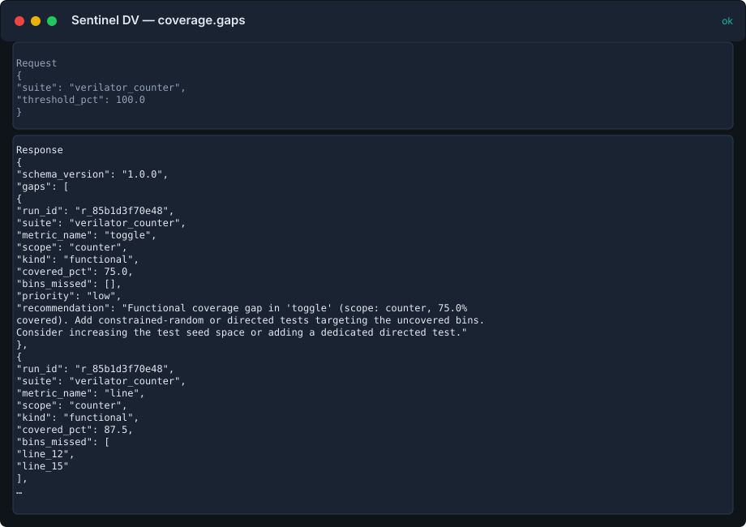

??? example "Request"
    ```json
    {
      "suite": "verilator_counter",
      "threshold_pct": 100.0
    }
    ```

??? success "Response"
    ```json
    {
      "schema_version": "1.0.0",
      "gaps": [
        {
          "run_id": "r_85b1d3f70e48",
          "suite": "verilator_counter",
          "metric_name": "toggle",
          "scope": "counter",
          "kind": "functional",
          "covered_pct": 75.0,
          "bins_missed": [],
          "priority": "low",
          "recommendation": "Functional coverage gap in 'toggle' (scope: counter, 75.0% covered). Add constrained-random or directed tests targeting the uncovered bins. Consider increasing the test seed space or adding a dedicated directed test."
        },
        {
          "run_id": "r_85b1d3f70e48",
          "suite": "verilator_counter",
          "metric_name": "line",
          "scope": "counter",
          "kind": "functional",
          "covered_pct": 87.5,
          "bins_missed": [
            "line_12",
            "line_15"
          ],
          "priority": "low",
          "recommendation": "Functional coverage gap in 'line' (scope: counter, 87.5% covered). Add constrained-random or directed tests targeting the uncovered bins. Consider increasing the test seed space or adding a dedicated directed test. Specifically, target: 'line_12', 'line_15'."
        }
      ],
      "pagination": {
        "page": 1,
        "page_size": 50,
        "total_items": 2,
        "total_pages": 1
      },
      "run_id": null,
      "suite": "verilator_counter",
      "kind": null,
      "priority": null,
      "threshold_pct": 100.0,
      "total_metrics": 2,
      "gaps_found": 2,
      "note": "Gaps are sorted by priority (high\u2192medium\u2192low) then by coverage percentage. Use coverage.advisor with an exact run_id and metric_name for a reviewable stimulus candidate. Showing page 1 of 1."
    }
    ```

## `failures.list`


??? example "Request"
    ```json
    {
      "category": "scoreboard",
      "page": 1,
      "page_size": 50
    }
    ```

??? success "Response"
    ```json
    {
      "schema_version": "1.0.0",
      "failures": [
        {
          "failure_id": "f_5e57ae5d5833",
          "failure_id_full": "5e57ae5d58333fd71d13fb6f10a728889b1746c310d1abde1707c1596e994da4",
          "test_id": "t_81f11ef7e513",
          "run_id": "r_3bd942f45ef3",
          "severity": "error",
          "category": "scoreboard",
          "summary": "DATA MISMATCH: expected count=3 got 5",
          "message": "DATA MISMATCH: expected count=3 got 5",
          "time_ns": 1250,
          "phase": null,
          "component": "uvm_test_top.env.scoreboard",
          "tags_json": "[\"scoreboard\", \"uvm\"]",
          "tags_flat": "scoreboard uvm",
          "signature_id": "s_89d86964979b"
        },
        {
          "failure_id": "f_86ecaa8d2065",
          "failure_id_full": "86ecaa8d20652e70937cbc32c2fc68b89853084a84fe69193ed97033369fa7ce",
          "test_id": "t_7a0a37762958",
          "run_id": "r_566fd6e9a21b",
          "severity": "error",
          "category": "scoreboard",
          "summary": "[SCB] DATA MISMATCH: expected count=3 got 5",
          "message": "[SCB] DATA MISMATCH: expected count=3 got 5",
          "time_ns": 0,
          "phase": null,
          "component": "uvm_test_top.env.scoreboard",
          "tags_json": "[\"scoreboard\", \"uvm\"]",
          "tags_flat": "scoreboard uvm",
          "signature_id": "s_31f7c4e8d3fa"
        },
        {
          "failure_id": "f_9225893b0dd9",
          "failure_id_full": "9225893b0dd9c7a90564117f97246cb99b62a292dab2e53af327e498d90cac2f",
          "test_id": "t_bdf825c67e63",
          "run_id": "r_c93470980bbc",
          "severity": "error",
          "category": "scoreboard",
          "summary": "[SCB] counter_scoreboard.sv:(88) @ 1250 DATA MISMATCH: expected count=3 got 5",
          "message": "[SCB] counter_scoreboard.sv:(88) @ 1250 DATA MISMATCH: expected count=3 got 5",
          "time_ns": 0,
          "phase": null,
          "component": "ns",
          "tags_json": "[\"scoreboard\", \"uvm\"]",
          "tags_flat": "scoreboard uvm",
          "signature_id": "s_167aa5eb920e"
        },
        {
          "failure_id": "f_db45c690a5dd",
          "failure_id_full": "db45c690a5dd03c360769251f7f206484bd8c396a881984bc940052704286671",
          "test_id": "t_7dd03c3d152f",
          "run_id": "r_2968fa34e74e",
          "severity": "error",
          "category": "scoreboard",
          "summary": "[SCB] AXI DATA MISMATCH: AW beat 3 expected 0xDEAD got 0xBEEF",
          "message": "[SCB] AXI DATA MISMATCH: AW beat 3 expected 0xDEAD got 0xBEEF",
          "time_ns": 0,
          "phase": null,
          "component": "uvm_test_top.axi_env.scoreboard",
          "tags_json": "[\"scoreboard\", \"uvm\", \"axi4\"]",
          "tags_flat": "scoreboard uvm axi4",
          "signature_id": "s_36ba5cf5dcf0"
        },
        {
          "failure_id": "f_e28595124a71",
          "failure_id_full": "e28595124a71dc81b63b4d4764ec36f0e37ea0ed965aaa824b98bcd4a31ebd54",
          "test_id": "t_3fb5c5afeb62",
          "run_id": "r_b1d6f6071a8b",
          "severity": "error",
          "category": "scoreboard",
          "summary": "[SCB] DATA MISMATCH: expected count=3 got 5",
          "message": "[SCB] DATA MISMATCH: expected count=3 got 5",
          "time_ns": 0,
          "phase": null,
          "component": "(uvm_test_top.env.scoreboard)",
          "tags_json": "[\"scoreboard\", \"uvm\"]",
          "tags_flat": "scoreboard uvm",
          "signature_id": "s_31f7c4e8d3fa"
        },
        {
          "failure_id": "f_52ca140d72a4",
          "failure_id_full": "52ca140d72a4828303a2fe7d74203a3da9d0832f5d2d3a5589972f0837c21ce9",
          "test_id": "t_e65285b55eec",
          "run_id": "r_bcde15e0d7db",
          "severity": "error",
          "category": "scoreboard",
          "summary": "Scoreboard mismatch: counter wrap check failed",
          "message": "\nExpected count to wrap at 15; observed 16 without wrap.\n      ",
          "time_ns": null,
          "phase": null,
          "component": null,
          "tags_json": "[\"scoreboard\", \"uvm\"]",
          "tags_flat": "scoreboard uvm",
          "signature_id": "s_171ee2cbf014"
        },
        {
          "failure_id": "f_81bb456a74ac",
          "failure_id_full": "81bb456a74acc3bf5ace5f82eddfd82a388fd613914b28235320bb43e512cb3b",
          "test_id": "t_b439c1f1e40d",
          "run_id": "r_e0e82e0b1722",
          "severity": "error",
          "category": "scoreboard",
          "summary": "Write-readback mismatch at address 0x000001C0",
          "message": "\n        UVM_ERROR @ 1248000: uvm_test_top.env.scbd [SCBD] FAIL: addr=0x000001C0 exp=0xDEADBEEF got=0x00000000\n        UVM_ERROR @ 1248000: uvm_test_top.env.scbd [SCBD] SCOREBOARD MISMATCHES DETECTED\n      ",
          "time_ns": null,
          "phase": null,
          "component": null,
          "tags_json": "[\"scoreboard\", \"uvm\"]",
          "tags_flat": "scoreboard uvm",
          "signature_id": "s_11ffe14f53ed"
        },
        {
          "failure_id": "f_b0e75506b88c",
          "failure_id_full": "b0e75506b88c8ed940b5c06dde26159fcf6ccd430f599ac2d7fa44cb57c1f5fa",
          "test_id": "t_731e321ad3c0",
          "run_id": "r_399aa82757dd",
          "severity": "error",
          "category": "scoreboard",
          "summary": "Scoreboard mismatch: counter wrap check failed",
          "message": "\nExpected count to wrap at 15; observed 16 without wrap.\n      ",
          "time_ns": null,
          "phase": null,
          "component": null,
          "tags_json": "[\"scoreboard\", \"uvm\"]",
          "tags_flat": "scoreboard uvm",
          "signature_id": "s_171ee2cbf014"
        },
        {
          "failure_id": "f_bc9b5cf421b9",
          "failure_id_full": "bc9b5cf421b9ab5df0919fef6c80eb490c6efa4e3b7e4f77c98b497e261e68fc",
          "test_id": "t_7f5785415392",
          "run_id": "r_12ec8baa2f30",
          "severity": "error",
          "category": "scoreboard",
          "summary": "Scoreboard mismatch: counter wrap check failed",
          "message": "\nExpected count to wrap at 15; observed 16 without wrap.\n      ",
          "time_ns": null,
          "phase": null,
          "component": null,
          "tags_json": "[\"scoreboard\", \"uvm\"]",
          "tags_flat": "scoreboard uvm",
          "signature_id": "s_171ee2cbf014"
        }
      ],
      "pagination": {
        "page": 1,
        "page_size": 50,
        "total_items": 9,
        "total_pages": 1
      }
    }
    ```

## `regressions.summary`


??? example "Request"
    ```json
    {
      "suite": "verilator_counter",
      "window_days": 30,
      "as_of": null
    }
    ```

??? success "Response"
    ```json
    {
      "suite": "verilator_counter",
      "window_days": 30,
      "as_of": "2026-07-31T05:26:42.935344Z",
      "pass_rate": 33.33,
      "runs": [
        {
          "run_id": "r_d39bb5009606",
          "suite": "verilator_counter",
          "status": "fail",
          "created_at": "2026-07-31T05:26:42.691787Z"
        },
        {
          "run_id": "r_85b1d3f70e48",
          "suite": "verilator_counter",
          "status": "pass",
          "created_at": "2026-07-31T05:26:42.687257Z"
        },
        {
          "run_id": "r_566fd6e9a21b",
          "suite": "verilator_counter",
          "status": "fail",
          "created_at": "2026-07-31T05:26:42.678688Z"
        }
      ],
      "top_signatures": [
        {
          "signature_id": "s_31f7c4e8d3fa",
          "category": "scoreboard",
          "summary": "[SCB] DATA MISMATCH: expected count=3 got 5",
          "count": 1
        },
        {
          "signature_id": "s_ea51e615c938",
          "category": "unknown",
          "summary": "Counter overflow not handled",
          "count": 1
        }
      ],
      "schema_version": "1.0.0"
    }
    ```

## `runs.diff`


??? example "Request"
    ```json
    {
      "base_run_id": "r_d39bb5009606",
      "compare_run_id": "r_85b1d3f70e48"
    }
    ```

??? success "Response"
    ```json
    {
      "base_run_id": "r_d39bb5009606",
      "compare_run_id": "r_85b1d3f70e48",
      "test_changes": [
        {
          "kind": "test_removed",
          "name": "counter_tb.test_counter_overflow",
          "base_status": "fail"
        },
        {
          "kind": "test_added",
          "name": "counter_tb.test_counter_sim",
          "compare_status": "pass"
        }
      ],
      "new_failures": [],
      "resolved_failures": [
        {
          "signature_id": "s_ea51e615c938",
          "count": 1
        }
      ],
      "persistent_failures": [],
      "coverage_deltas": [
        {
          "kind": "functional",
          "metric_name": "line",
          "scope": "counter",
          "base_covered_pct": null,
          "compare_covered_pct": 87.5,
          "delta_pct": null
        },
        {
          "kind": "functional",
          "metric_name": "toggle",
          "scope": "counter",
          "base_covered_pct": null,
          "compare_covered_pct": 75.0,
          "delta_pct": null
        }
      ],
      "schema_version": "1.0.0"
    }
    ```

## `sim.status`

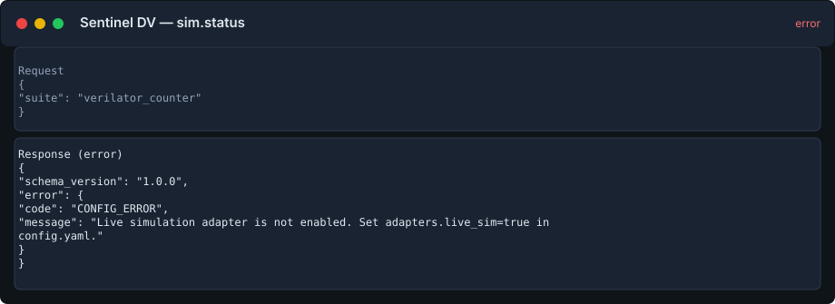

??? example "Request"
    ```json
    {
      "suite": "verilator_counter"
    }
    ```

??? success "Response"
    ```json
    {
      "schema_version": "1.0.0",
      "error": {
        "code": "CONFIG_ERROR",
        "message": "Live simulation adapter is not enabled. Set adapters.live_sim=true in config.yaml."
      }
    }
    ```

## `wave.signals`


??? example "Request"
    ```json
    {
      "test_id": "t_3bb6bfc925aa"
    }
    ```

??? success "Response"
    ```json
    {
      "test_id": "t_3bb6bfc925aa",
      "format": "precomputed-vcd",
      "end_time_ns": 10000,
      "start_time_ns": null,
      "end_time_ns_query": null,
      "signals": [
        {
          "name": "clk",
          "group": "counter",
          "width": 1,
          "toggles": 100,
          "last_value": "0"
        },
        {
          "name": "count",
          "group": "counter",
          "width": 4,
          "toggles": 16,
          "last_value": "0xf"
        },
        {
          "name": "rst",
          "group": "counter",
          "width": 1,
          "toggles": 2,
          "last_value": "0"
        }
      ],
      "signal_count": 3,
      "truncated": false,
      "source_path": "verilator_counter/test_counter_sim.wave.json",
      "schema_version": "1.0.0"
    }
    ```

## `wave.summary`


??? example "Request"
    ```json
    {
      "test_id": "t_3bb6bfc925aa",
      "start_time_ns": 1000,
      "end_time_ns": 25000
    }
    ```

??? success "Response"
    ```json
    {
      "test_id": "t_3bb6bfc925aa",
      "format": "precomputed-vcd",
      "end_time_ns": 25000,
      "start_time_ns": 1000,
      "end_time_ns_query": 25000,
      "signal_count": 3,
      "highlights": [
        {
          "time_ns": 1000,
          "signal": "rst",
          "value": "0",
          "note": "reset released"
        },
        {
          "time_ns": 2500,
          "signal": "count",
          "value": "0x3",
          "note": "counter increment window"
        }
      ],
      "highlight_groups": {
        "reset_event": [
          {
            "time_ns": 1000,
            "signal": "rst",
            "value": "0",
            "note": "reset released"
          }
        ],
        "event": [
          {
            "time_ns": 2500,
            "signal": "count",
            "value": "0x3",
            "note": "counter increment window"
          }
        ]
      },
      "signal_groups": null,
      "metadata": {
        "source": "checked-in demo fixture",
        "generator": "verilator-vcd-summary",
        "window": {
          "start_time_ns": 1000,
          "end_time_ns": 25000,
          "note": "JSON summaries filter highlights only; use VCD for per-signal window values"
        }
      },
      "evidence": {
        "kind": "waveform_summary",
        "path": "verilator_counter/test_counter_sim.wave.json"
      },
      "source_path": "verilator_counter/test_counter_sim.wave.json",
      "schema_version": "1.0.0"
    }
    ```

## `coverage.trend`

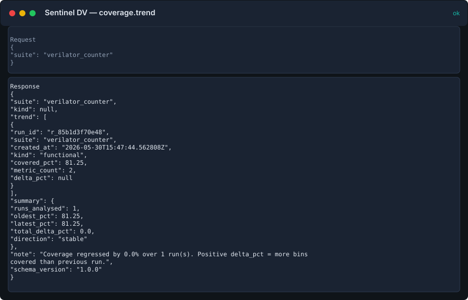

??? example "Request"
    ```json
    {
      "suite": "verilator_counter"
    }
    ```

??? success "Response"
    ```json
    {
      "suite": "verilator_counter",
      "kind": null,
      "trend": [
        {
          "run_id": "r_85b1d3f70e48",
          "suite": "verilator_counter",
          "created_at": "2026-07-31T05:26:42.687257Z",
          "kind": "functional",
          "covered_pct": 81.25,
          "metric_count": 2,
          "delta_pct": null
        }
      ],
      "summary": {
        "runs_analysed": 1,
        "oldest_pct": 81.25,
        "latest_pct": 81.25,
        "total_delta_pct": 0.0,
        "direction": "stable"
      },
      "note": "Coverage stable with a net change of +0.0% over 1 run(s). Positive delta_pct = more bins covered than previous run.",
      "schema_version": "1.0.0"
    }
    ```

## `runs.cross_sim`

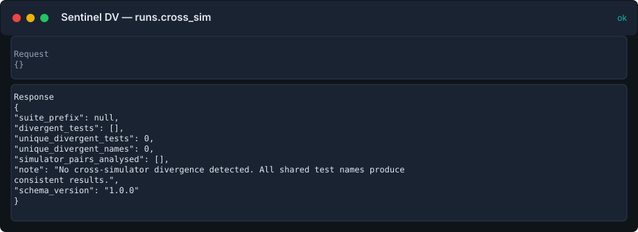

??? example "Request"
    ```json
    {}
    ```

??? success "Response"
    ```json
    {
      "suite_prefix": null,
      "divergent_tests": [],
      "unique_divergent_tests": 0,
      "unique_divergent_names": 0,
      "simulator_pairs_analysed": [],
      "note": "No cross-simulator divergence detected. All shared test names produce consistent results.",
      "schema_version": "1.0.0"
    }
    ```

## `tests.cluster`

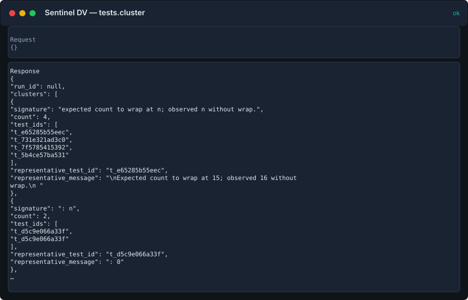

??? example "Request"
    ```json
    {}
    ```

??? success "Response"
    ```json
    {
      "run_id": null,
      "clusters": [
        {
          "signature": "s_171ee2cbf014",
          "failure_count": 3,
          "count": 3,
          "distinct_test_count": 3,
          "distinct_run_count": 3,
          "representative_test_id": "t_e65285b55eec",
          "representative_message": "\nExpected count to wrap at 15; observed 16 without wrap.\n      ",
          "test_ids": [
            "t_731e321ad3c0",
            "t_7f5785415392",
            "t_e65285b55eec"
          ],
          "test_ids_truncated": false,
          "run_ids": [
            "r_12ec8baa2f30",
            "r_399aa82757dd",
            "r_bcde15e0d7db"
          ],
          "run_ids_truncated": false,
          "severity_counts": {
            "error": 3
          },
          "category_counts": {
            "scoreboard": 3
          }
        },
        {
          "signature": "s_31f7c4e8d3fa",
          "failure_count": 2,
          "count": 2,
          "distinct_test_count": 2,
          "distinct_run_count": 2,
          "representative_test_id": "t_7a0a37762958",
          "representative_message": "[SCB] DATA MISMATCH: expected count=3 got 5",
          "test_ids": [
            "t_3fb5c5afeb62",
            "t_7a0a37762958"
          ],
          "test_ids_truncated": false,
          "run_ids": [
            "r_566fd6e9a21b",
            "r_b1d6f6071a8b"
          ],
          "run_ids_truncated": false,
          "severity_counts": {
            "error": 2
          },
          "category_counts": {
            "scoreboard": 2
          }
        },
        {
          "signature": "s_0a70541895bb",
          "failure_count": 1,
          "count": 1,
          "distinct_test_count": 1,
          "distinct_run_count": 1,
          "representative_test_id": "t_bdf825c67e63",
          "representative_message": "[TEST] counter_tb.sv:(92) @ 1300 TEST FAILED",
          "test_ids": [
            "t_bdf825c67e63"
          ],
          "test_ids_truncated": false,
          "run_ids": [
            "r_c93470980bbc"
          ],
          "run_ids_truncated": false,
          "severity_counts": {
            "fatal": 1
          },
          "category_counts": {
            "unknown": 1
          }
        },
        {
          "signature": "s_11ffe14f53ed",
          "failure_count": 1,
          "count": 1,
          "distinct_test_count": 1,
          "distinct_run_count": 1,
          "representative_test_id": "t_b439c1f1e40d",
          "representative_message": "\n        UVM_ERROR @ 1248000: uvm_test_top.env.scbd [SCBD] FAIL: addr=0x000001C0 exp=0xDEADBEEF got=0x00000000\n        UVM_ERROR @ 1248000: uvm_test_top.env.scbd [SCBD] SCOREBOARD MISMATCHES DETECTED\n",
          "test_ids": [
            "t_b439c1f1e40d"
          ],
          "test_ids_truncated": false,
          "run_ids": [
            "r_e0e82e0b1722"
          ],
          "run_ids_truncated": false,
          "severity_counts": {
            "error": 1
          },
          "category_counts": {
            "scoreboard": 1
          }
        },
        {
          "signature": "s_167aa5eb920e",
          "failure_count": 1,
          "count": 1,
          "distinct_test_count": 1,
          "distinct_run_count": 1,
          "representative_test_id": "t_bdf825c67e63",
          "representative_message": "[SCB] counter_scoreboard.sv:(88) @ 1250 DATA MISMATCH: expected count=3 got 5",
          "test_ids": [
            "t_bdf825c67e63"
          ],
          "test_ids_truncated": false,
          "run_ids": [
            "r_c93470980bbc"
          ],
          "run_ids_truncated": false,
          "severity_counts": {
            "error": 1
          },
          "category_counts": {
            "scoreboard": 1
          }
        },
        {
          "signature": "s_36ba5cf5dcf0",
          "failure_count": 1,
          "count": 1,
          "distinct_test_count": 1,
          "distinct_run_count": 1,
          "representative_test_id": "t_7dd03c3d152f",
          "representative_message": "[SCB] AXI DATA MISMATCH: AW beat 3 expected 0xDEAD got 0xBEEF",
          "test_ids": [
            "t_7dd03c3d152f"
          ],
          "test_ids_truncated": false,
          "run_ids": [
            "r_2968fa34e74e"
          ],
          "run_ids_truncated": false,
          "severity_counts": {
            "error": 1
          },
          "category_counts": {
            "scoreboard": 1
          }
        },
        {
          "signature": "s_7a0796e85275",
          "failure_count": 1,
          "count": 1,
          "distinct_test_count": 1,
          "distinct_run_count": 1,
          "representative_test_id": "t_3fb5c5afeb62",
          "representative_message": "[TEST] TEST FAILED",
          "test_ids": [
            "t_3fb5c5afeb62"
          ],
          "test_ids_truncated": false,
          "run_ids": [
            "r_b1d6f6071a8b"
          ],
          "run_ids_truncated": false,
          "severity_counts": {
            "fatal": 1
          },
          "category_counts": {
            "unknown": 1
          }
        },
        {
          "signature": "s_7ed619f7cb5c",
          "failure_count": 1,
          "count": 1,
          "distinct_test_count": 1,
          "distinct_run_count": 1,
          "representative_test_id": "t_e79a0d869304",
          "representative_message": "[MON] ASSERTION FAILED: pready_timeout after psel",
          "test_ids": [
            "t_e79a0d869304"
          ],
          "test_ids_truncated": false,
          "run_ids": [
            "r_07d0f584403c"
          ],
          "run_ids_truncated": false,
          "severity_counts": {
            "error": 1
          },
          "category_counts": {
            "assertion": 1
          }
        },
        {
          "signature": "s_81b0397b3f81",
          "failure_count": 1,
          "count": 1,
          "distinct_test_count": 1,
          "distinct_run_count": 1,
          "representative_test_id": "t_cf16259fcc9e",
          "representative_message": "\npop while empty: empty flag was 0\n      ",
          "test_ids": [
            "t_cf16259fcc9e"
          ],
          "test_ids_truncated": false,
          "run_ids": [
            "r_c6f691e1ad14"
          ],
          "run_ids_truncated": false,
          "severity_counts": {
            "error": 1
          },
          "category_counts": {
            "unknown": 1
          }
        },
        {
          "signature": "s_89d86964979b",
          "failure_count": 1,
          "count": 1,
          "distinct_test_count": 1,
          "distinct_run_count": 1,
          "representative_test_id": "t_81f11ef7e513",
          "representative_message": "DATA MISMATCH: expected count=3 got 5",
          "test_ids": [
            "t_81f11ef7e513"
          ],
          "test_ids_truncated": false,
          "run_ids": [
            "r_3bd942f45ef3"
          ],
          "run_ids_truncated": false,
          "severity_counts": {
            "error": 1
          },
          "category_counts": {
            "scoreboard": 1
          }
        },
        {
          "signature": "s_9a453c8f8338",
          "failure_count": 1,
          "count": 1,
          "distinct_test_count": 1,
          "distinct_run_count": 1,
          "representative_test_id": "t_ce337fb0bfda",
          "representative_message": "\nTraceback (most recent call last):\n  File \"test_counter.py\", line 45, in test_overflow\n    assert dut.count.value == 0, \"Counter should wrap to 0\"\nAssertionError: Counter overflow not handled correct",
          "test_ids": [
            "t_ce337fb0bfda"
          ],
          "test_ids_truncated": false,
          "run_ids": [
            "r_0fb765971a20"
          ],
          "run_ids_truncated": false,
          "severity_counts": {
            "error": 1
          },
          "category_counts": {
            "unknown": 1
          }
        },
        {
          "signature": "s_e8185f767f71",
          "failure_count": 1,
          "count": 1,
          "distinct_test_count": 1,
          "distinct_run_count": 1,
          "representative_test_id": "t_fed229b40a64",
          "representative_message": "\nExpected 16-bit result; got value out of range.\n      ",
          "test_ids": [
            "t_fed229b40a64"
          ],
          "test_ids_truncated": false,
          "run_ids": [
            "r_26595f0640e8"
          ],
          "run_ids_truncated": false,
          "severity_counts": {
            "error": 1
          },
          "category_counts": {
            "unknown": 1
          }
        },
        {
          "signature": "s_ea51e615c938",
          "failure_count": 1,
          "count": 1,
          "distinct_test_count": 1,
          "distinct_run_count": 1,
          "representative_test_id": "t_5b4ce57ba531",
          "representative_message": "\nExpected count to wrap at 15; observed 16 without wrap.\n      ",
          "test_ids": [
            "t_5b4ce57ba531"
          ],
          "test_ids_truncated": false,
          "run_ids": [
            "r_d39bb5009606"
          ],
          "run_ids_truncated": false,
          "severity_counts": {
            "error": 1
          },
          "category_counts": {
            "unknown": 1
          }
        },
        {
          "signature": "s_f635f13d2227",
          "failure_count": 1,
          "count": 1,
          "distinct_test_count": 1,
          "distinct_run_count": 1,
          "representative_test_id": "t_81f11ef7e513",
          "representative_message": "TEST FAILED",
          "test_ids": [
            "t_81f11ef7e513"
          ],
          "test_ids_truncated": false,
          "run_ids": [
            "r_3bd942f45ef3"
          ],
          "run_ids_truncated": false,
          "severity_counts": {
            "fatal": 1
          },
          "category_counts": {
            "unknown": 1
          }
        }
      ],
      "total_failures_analysed": 17,
      "unique_clusters": 14,
      "clusters_returned": 14,
      "clusters_truncated": false,
      "note": "14 signature cluster(s) group 17 failure(s). Top cluster accounts for 17.6% of failures. Investigate a representative failure from each leading cluster first.",
      "schema_version": "1.0.0"
    }
    ```

## `regression.health`

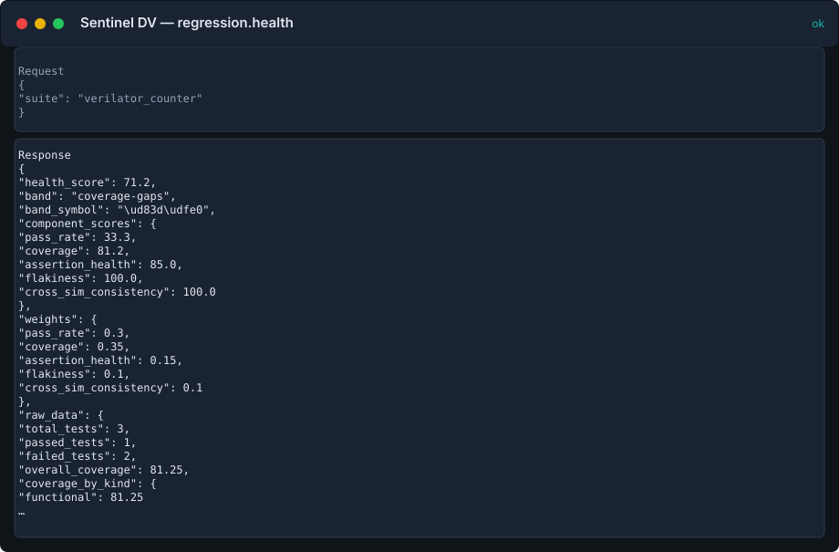

??? example "Request"
    ```json
    {
      "suite": "verilator_counter"
    }
    ```

??? success "Response"
    ```json
    {
      "health_score": 59.1,
      "band": "coverage-gaps",
      "band_symbol": "\ud83d\udfe0",
      "component_scores": {
        "pass_rate": 33.3,
        "coverage": 81.2,
        "assertion_health": null,
        "flakiness": null,
        "cross_sim_consistency": null
      },
      "weights": {
        "pass_rate": 0.3,
        "coverage": 0.35,
        "assertion_health": 0.15,
        "flakiness": 0.1,
        "cross_sim_consistency": 0.1
      },
      "effective_weights": {
        "pass_rate": 0.4615,
        "coverage": 0.5385
      },
      "data_quality": {
        "coverage_available": true,
        "assertion_health_available": false,
        "flakiness_available": false,
        "cross_sim_consistency_available": false,
        "warnings": [
          "No assertion definitions or SVA status were indexed; assertion health is unavailable.",
          "No repeated test cohorts were indexed; flakiness is unavailable.",
          "No comparable multi-simulator cohorts were indexed; cross-simulator consistency is unavailable."
        ]
      },
      "raw_data": {
        "total_tests": 3,
        "passed_tests": 1,
        "failed_tests": 2,
        "overall_coverage": 81.25,
        "coverage_by_kind": {
          "functional": 81.25
        },
        "total_assertions": 0,
        "vacuous_assertions": 0,
        "failing_assertions": 0,
        "flaky_tests": 0,
        "history_cohorts": 0,
        "divergent_tests": 0,
        "cross_sim_cohorts": 0,
        "scope": {
          "run_id": null,
          "suite": "verilator_counter"
        },
        "heuristics": {
          "flaky_tests": "A test cohort is flagged when both pass and fail outcomes exist in indexed history for the scoped suite.",
          "divergent_tests": "Latest pass/fail outcomes differ across simulators within the same suite, framework, DUT top, and test name."
        }
      },
      "recommendations": [
        "Pass rate is 33% (2 failures). Use tests.cluster to group recurring failure signatures.",
        "Index assertion definition/status artifacts before using health score for sign-off.",
        "Index repeated runs for the same test cohorts before evaluating flakiness.",
        "Index matching test cohorts from at least two simulators before evaluating cross-simulator consistency."
      ],
      "note": "\ud83d\udfe0 Health score: 59.1/100 (coverage-gaps). Breakdown \u2014 pass_rate: 33%, coverage: 81%, assertions: unavailable, flakiness: unavailable, cross-sim: unavailable.",
      "schema_version": "1.0.0"
    }
    ```

## `coverage.advisor`

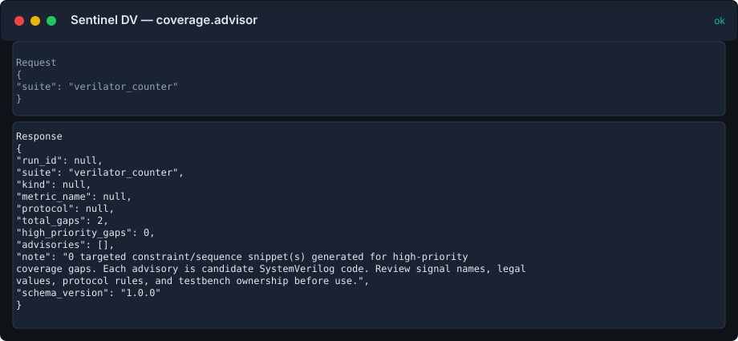

??? example "Request"
    ```json
    {
      "suite": "verilator_counter"
    }
    ```

??? success "Response"
    ```json
    {
      "run_id": null,
      "suite": "verilator_counter",
      "kind": null,
      "metric_name": null,
      "protocol": null,
      "total_gaps": 2,
      "high_priority_gaps": 0,
      "advisories": [],
      "note": "0 targeted constraint/sequence snippet(s) generated for high-priority coverage gaps. Each advisory is candidate SystemVerilog code. Review signal names, legal values, protocol rules, and testbench ownership before use.",
      "schema_version": "1.0.0"
    }
    ```
